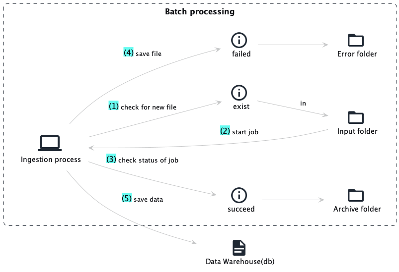
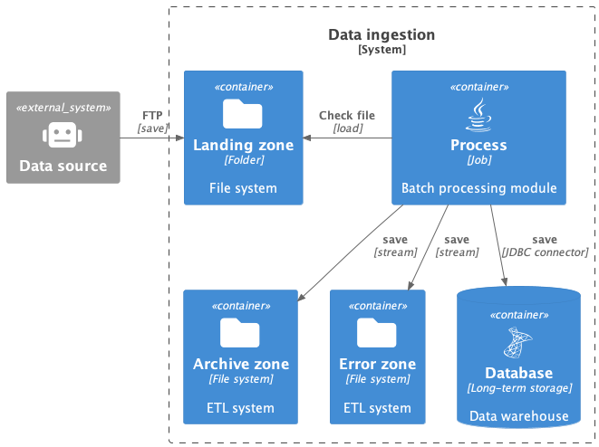
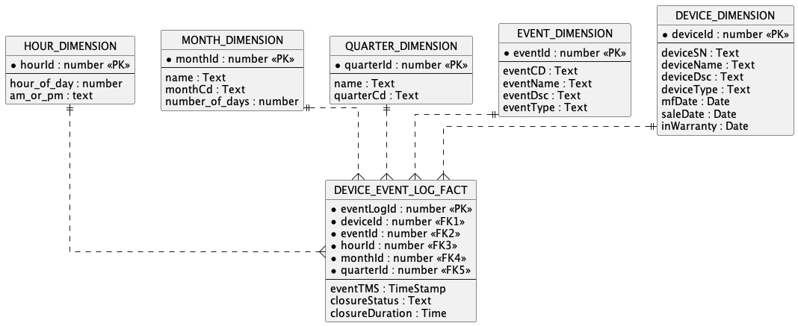

# ETL and ingestion batchprocess
## Introduction
This project aim to build a data engineering project to solve the following data ingestion problem:
## Problem statement
Company XYZ is a third-party vendor that provides services for building and maintaining data centers. Now, Company XYZ is planning to build a data center monitoring tool for its customer. The customer wants to see various useful metrics, such as the number of incidents reported for any device on an hourly, monthly, or quarterly basis. They also want reports on closure ratios and average closure duration. They are also interested in searching incidents based on the type of device or incident type. They are also interested to find time-based outage patterns to predict seasonal or hourly usage surges for any set of resources. These reports need to be generated once every 12 hours. To generate such reports, a data warehouse needs to be built, and data must be ingested and stored daily in that data warehouse so that such reports can easily be generated.
### Domain story diagrams

### Solution architecture(System Context)

### Data modeling solution(Star model)

